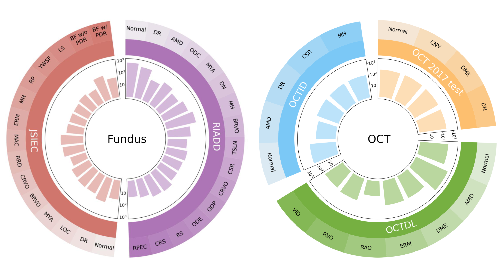

# BenchReAD
Official code for BenchReAD: A systematic benchmark for retinal anomaly detection (MICCAI 2025)

<div align="center">

</div>

## Getting started
### 1 Requirements
OS: Ubuntu 20.04 LTS.

Language: Python 3.10.8

Create a virtual environment and install the dependencies through the following command:

```
pip install numpy
pip install pandas
pip install tqdm
pip install scikit-image
pip install opencv-python
```


### 2 Building fundus benchmark


#### 2.1 Training and validation sets establishment
The traning and validation sets of the fundus benchmark are build on the EDDFS [1] and BRSET [2] datasets. The following steps are used to establish the training and validation sets.

1. Download the [EDDFS](https://github.com/xia-xx-cv/EDDFS_dataset) and [BRSET](https://physionet.org/content/brazilian-ophthalmological/1.0.1/) datasets from the links.

2. Put the EDDFS data in the `./data/EDDFS/OriginalImages` folder and the [annotations](https://github.com/xia-xx-cv/EDDFS_dataset/tree/main/datas/EDDFS/Annotation) in the `./data/EDDFS` folder.

3. Preprocessing the EDDFS data using the [EDDFS_preprocessing.ipynb](./fundus/EDDFS_preprocessing.ipynb) and [EDDFS_split.ipynb](./fundus/EDDFS_split.ipynb) notebooks.

4. Put the BRSET data in the `./data/brazilian-ophthalmological/` folder.

5. Preprocessing the BRSET data using the [BRSET_preprocessing.ipynb](./fundus/BRSET_preprocessing.ipynb) and [BRSET_split.ipynb](./fundus/BRSET_split.ipynb) notebooks.

#### 2.2 Testing sets establishment
The testing sets of the fundus benchmark are build on the RIADD [3] and JSIEC [4] datasets. The following steps are used to establish the testing sets.

1. Download the [RIADD](https://riadd.grand-challenge.org/) and [JSIEC](https://www.kaggle.com/datasets/linchundan/fundusimage1000) datasets from the links.

2. Put the RIADD data in the `./data/RIADD/` folder.

3. Preprocessing the RIADD data using the [RIADD_preprocessing.ipynb](./fundus/RIADD_preprocessing.ipynb) and [RIADD_split.ipynb](./fundus/RIADD_split.ipynb) notebooks.

4. Put the JSIEC data in the `./data/JSIEC/` folder.

5. Preprocessing the JSIEC data using the [JSIEC.ipynb](./fundus/JSIEC.ipynb) notebook.

### 3 Building OCT benchmark

#### 3.1 Training & validation set establishment
The training and validation sets of the OCT benchmark are build on the OCT 2017 [5] dataset. The following steps are used to establish the training and validation sets.

1. Download the [OCT 2017](https://www.kaggle.com/datasets/paultimothymooney/kermany2018) dataset from the link.

2. Put the OCT 2017 data in the `./data/OCT_2017/` folder.

3. Preprocessing the OCT 2017 data using the [OCT_2017_preprocessing.ipynb](./oct/OCT_2017_preprocessing.ipynb) and [OCT_2017_split.ipynb](./oct/OCT_2017_split.ipynb) notebooks.

4. The process above also generate the OCT 2017 dataset for testing.

#### 3.2 Testing set establishment
In addition to the OCT 2017 testing set, the testing sets of the OCT benchmark also include the OCTDL [6] and OCTID [7] datasets. The following steps are used to establish the testing sets.

1. Download the [OCTDL](https://data.mendeley.com/datasets/sncdhf53xc/4) and [OCTID](https://www.kaggle.com/datasets/saifurrahmanshatil/retinal-oct-dataset) datasets from the links.

2. Put the OCTDL and OCTID data in the `./data/OCTDL/` and `./data/OCTID/` folders, respectively.

3. Preprocessing the OCTDL data using the [OCTDL.ipynb](./OCT/OCTDL.ipynb) notebook.

4. Preprocessing the OCTID data using the [OCTID_step1.ipynb](./OCT/OCTID_step1.ipynb) and [OCTID_step2.ipynb](./OCT/OCTID_step2.ipynb) notebooks.

---

### 4 The proposed NFM-DRA 
See [NFM-DRA](./NFM-DRA/NFM-DRA.md) for more details.


## Acknowledgments

Thank the authors of [DRA](https://github.com/Choubo/DRA/tree/main), [PatchCore](https://github.com/amazon-science/patchcore-inspection) for their code, which are used in this project.

## Dataset References

[1] Xia, X., Li, Y., Xiao, G., Zhan, K., Yan, J., Cai, C., Fang, Y., Huang, G.: Benchmarking deep models on retinal fundus disease diagnosis and a large-scale dataset. Signal Processing: Image Communication 127, 117151 (2024).

[2] Nakayama, L.F., Restrepo, D., Matos, J., Ribeiro, L.Z., Malerbi, F.K., Celi, L.A., et al.: Brset: A brazilian multilabel ophthalmological dataset of retina fundus photos. PLOS Digital Health 3(7), e0000454 (2024).

[3] Pachade, S., Porwal, P., Thulkar, D., Kokare, M., Deshmukh, G., Sahasrabuddhe, V., Giancardo, L., Quellec, G., Mériaudeau, F.: Retinal fundus multi-disease image dataset (rfmid): a dataset for multi-disease detection research. Data 6(2), 14 (2021)

[4] Cen, L.P., Ji, J., Lin, J.W., Ju, S.T., Lin, H.J., Li, T.P., Wang, Y., Yang, J.F., Liu, Y.F., Tan, S., et al.: Automatic detection of 39 fundus diseases and conditions in retinal photographs using deep neural networks. Nature communications 12(1), 4828 (2021)

[5] Kermany, D.S., Goldbaum, M., Cai, W., Valentim, C.C., Liang, H., Baxter, S.L., McKeown, A., Yang, G., Wu, X., Yan, F., et al.: Identifying medical diagnoses and treatable diseases by image-based deep learning. cell 172(5), 1122–1131 (2018)

[6] Kulyabin, M., Zhdanov, A., Nikiforova, A., Stepichev, A., Kuznetsova, A., Ronkin, M., Borisov, V., Bogachev, A., Korotkich, S., Constable, P.A., et al.: Octdl: Optical coherence tomography dataset for image-based deep learning methods. Scientific Data 11(1), 365 (2024)

[7] Gholami, P., Roy, P., Parthasarathy, M.K., Lakshminarayanan, V.: Octid: Optical coherence tomography image database. Computers & Electrical Engineering 81, 106532 (2020)